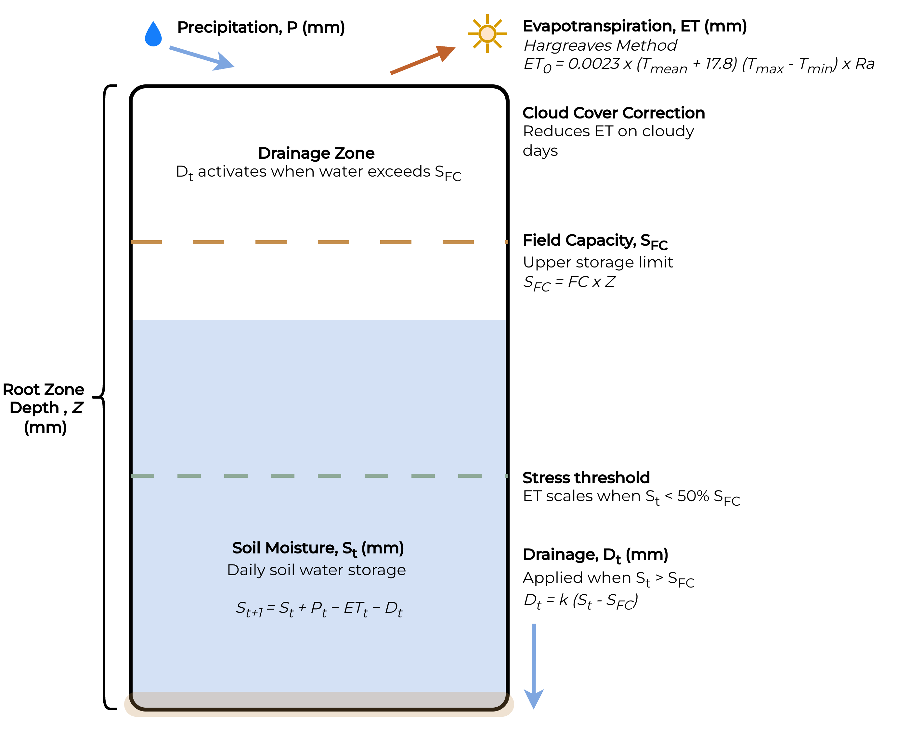
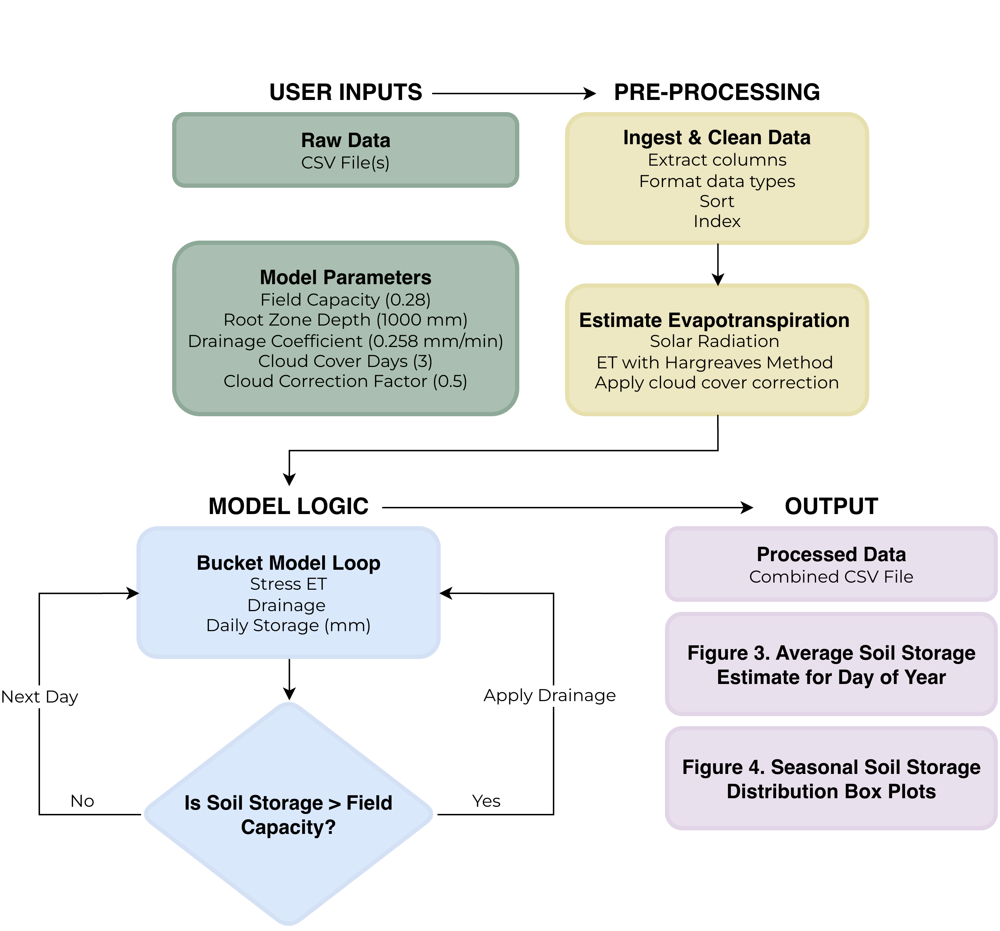
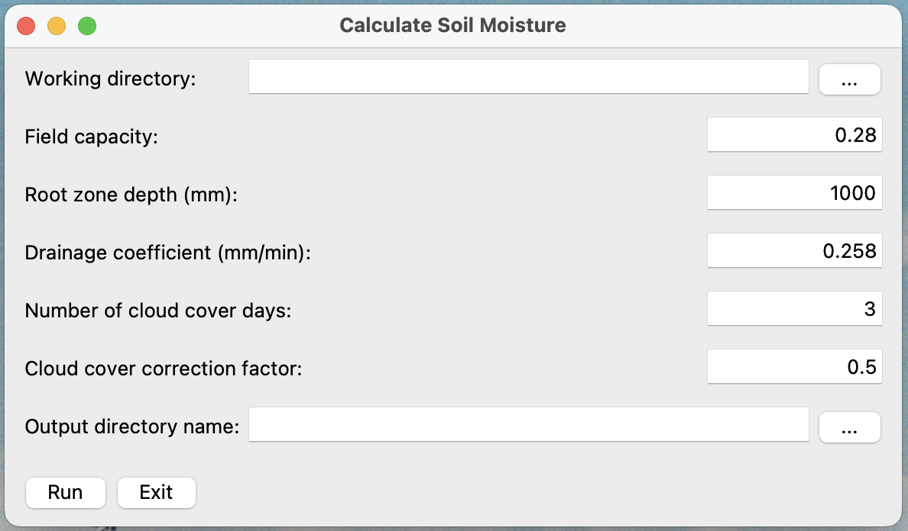
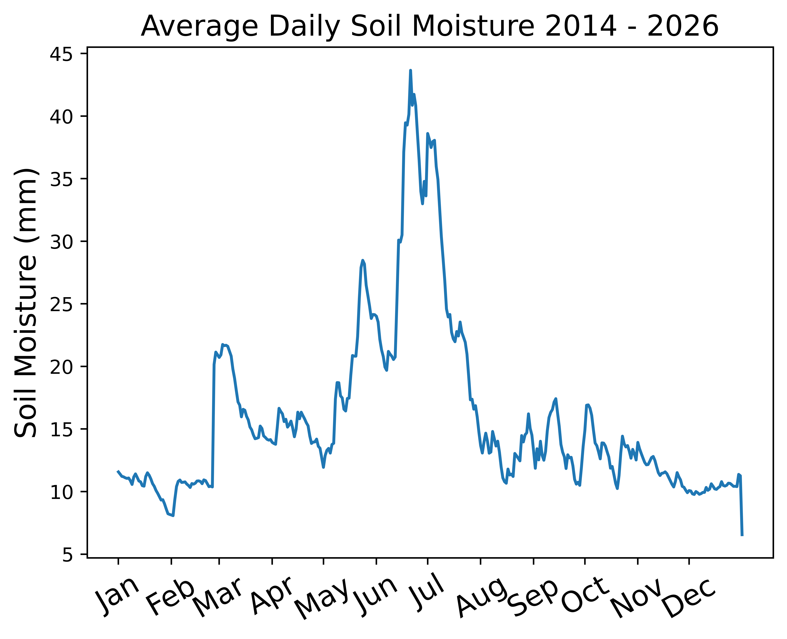
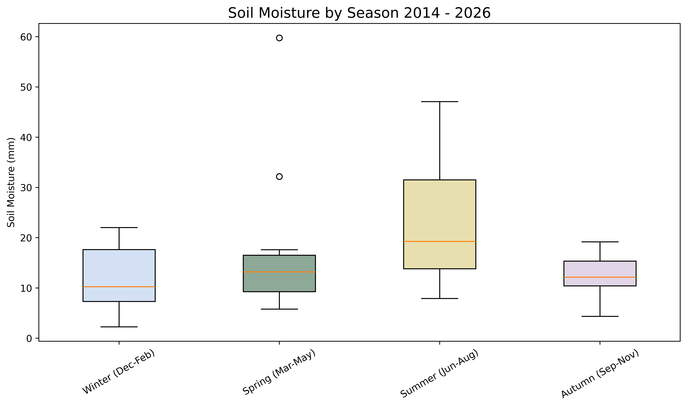

# Modeling Daily Soil Moisture in Lethbridge, Alberta: A Water Balance Approach

## 1.0 Introduction
Soil moisture sits at the centre of land-climate interactions. Through evapotranspiration, it determines how solar energy is distributed across continents; this dynamic directly impacts trends in air temperature and precipitation (Seneviratne et al., 2010). Consequently, shifts in soil moisture under warming conditions lead to changes in vegetation (Seneviratne et al., 2010). Characterizing soil moisture trends is therefore critical for anticipating and mitigating losses in biodiversity and agricultural productivity.

In Canada, the Prairie ecoregion provides important ecosystem services and contributes substantially to the national economy through agricultural production (Selby, Loring & Baulch, 2025, Chipanshi et al., 2021). Altered soil moisture dynamics pose a threat to these benefits, warranting further investigation into how these effects can be reduced (Hanesiak et al., 2011). Lethbridge, Alberta is a natural area of interest for such an investigation because it is key for Canada’s agricultural sector (Government of Canada Census of Agriculture, 2021). Understanding soil moisture trends here may help to address land management and irrigation concerns for the region. Additionally, the availability of rich historical climate records makes it well-suited for a model-based approach.
Ideally, soil moisture trends would be determined from direct sampling; however, direct measurement of soil properties can be costly and demanding (Rasheed et al., 2022). Model-based approaches offer a practical alternative by using existing climate data to estimate soil moisture (European Research Council, 2020), where process-based models in particular are useful because they reflect physically-grounded hydrological dynamics.

The objectives of this study are to develop a process-based model that estimates daily soil moisture from historical climate data, and to apply it to Lethbridge, AB over a 12-year period to characterize regional soil moisture trends in the Canadian Prairies.

## 2.0 Input Data
The model accepts climate data in comma-separated values (CSV) format, where required fields are described in Table 1.  

**Table 1.** Required input fields for the soil moisture model, with expected format and units.
| Field | Description | Format or Unit |
|---|---|---|
|date |Recording date |DD/MM/YYYY
|min_temp | Minimum air temperature |°C
|max_temp | Maximum air temperature |°C
|avg_temp | Average air temperature |°C
|precip |Precipitation |mm

The climate records used for developing this model were obtained from the Alberta Climate  Information Services (ACIS) Current and Historical Alberta Weather Station Data Viewer (Government of Alberta, 2026b). The site of interest is the Lethbridge weather station, located in Lethbridge, AB (Figure 1). As the ACIS data portal limits downloads to three years of data at a time, four CSV files were obtained to cover a total period of 12 years.

**Figure 1.** Location of the Lethbridge, AB weather station (49.68° N, 112.75° W) within the Canadian Prairies. The inset shows the station's position relative to the city. Imagery from Google Earth.

## 3.0 Methods
### 3.1 Model Description
The model is a 0D bucket model of soil moisture based on the mass balance equation described by Rodriguez-Iturbe et al. (1999). It is a simplified, physically-based model that takes the specified climate data (Table 1) and estimates evapotranspiration and drainage processes to determine soil moisture trends over time (Equation 1, Figure 2). As the input data represents daily air temperature and precipitation as aggregates from the Lethbridge weather station, the model is only representative of the area surrounding the weather station itself. Additionally, this model does not take into consideration lateral movement of water through soil, and so will estimate general trends of soil moisture rather than being spatially precise.

(1) $$S_{t+1} = S_t + P_t - ET_t - D_t$$

St represents soil water storage at one day in mm. The initial value of St is estimated as 50% of field capacity, representing a reasonable starting point for soil moisture where the substrate is neither completely dry nor saturated. Pt represents the total precipitation and Et represents the evapotranspiration for that day, respectively. Et is calculated using Hargreaves’ equation, (Equation 2, Hargreaves & Samani, 1982), where the factor 0.408 was used to convert from MJ/m² to mm of evaporation. Solar radiation (Ra) is calculated with pvlib.irradiance.get_extra_radiation, estimated from the day of the year for each record (version 0.15.0 Anderson et al., 2024).

(2) $$ET_0 = 0.0023 \cdot (T_{mean} + 17.8) \cdot (T_{max} - T_{min}) \cdot R_a $$

ET₀ is further adjusted to account for cloud cover and water stress. ET₀ is reduced on days with precipitation and the N days preceding them to account for reduced solar radiation under cloud cover (Equation 3), where Fcloud is the user-specified cloud reduction factor applied within the cloud cover window, and 1.0 otherwise. The default value of Fcloud is 0.5, representing a conservative reduction in solar radiation during cloudy periods. The default value for cloud cover window is set to 3, based on climate normals data that suggest precipitation events are typically 2 to 3 days apart during the growing season in Lethbridge (Environment and Climate Change Canada, 2026). Furthermore, when soil storage falls below 50% of field capacity, ET is scaled proportionally to reflect reduced plant water availability (Equation 4, Equation 5).

(3) $$ET_{corrected} = ET_0 \cdot F_{cloud}$$

(4) $$ Stress = \min\!\left(1,\ \frac{S_t}{0.5 \cdot S_{FC}}\right)$$

(5) $$ET_{Stress} = ET_{corrected} \cdot Stress$$

Dt represents soil drainage, where the surface is represented as having a fixed capacity for holding water (Manabe, 1969). Dt is outlined in Equation 6, where SFC represents field capacity or the maximum capacity for water at the site and k is the drainage coefficient determined by soil texture.

(6) $$D_t = \begin{cases} k \cdot (S_t - S_{FC}) & \text{if } S_t > S_{FC} \\ 0 & \text{if } S_t \leq S_{FC} \end{cases} $$

Finally, SFC  is a constant inferred by multiplying the soil texture by the root zone depth (Z). Since St is reported in mm, the model requires the user to report Z in the same units (Equation 7). The default value of field capacity (𝛳FC), was estimated using soil texture as an intermediate parameter that is not explicitly modeled. Soil texture for the Lethbridge area was obtained from the Alberta Soil Information Viewer (Government of Alberta, 2016), and the corresponding 𝛳FC for the Lethbridge area was then derived based on Saxton and Rawls’ estimates of water characteristic values for texture classes at 2.5%w organic matter (2006). The default value of Z was set to 1000 mm, representing the typical root zone depth for crops grown in Lethbridge (Fan et al., 2016).

(7) $$S_{FC} = FC \cdot Z$$

The model produces daily estimates of soil water storage (mm) over the period of record, capturing the effects of precipitation, evapotranspiration, and drainage on soil moisture dynamics. These estimates are summarized as average trends and seasonal distributions, providing insight into how soil moisture varies across and between seasons at the site.

**Figure 2.** Conceptual diagram of the daily water balance bucket model based on Rodriguez-Iturbe et al. (1999). Precipitation enters the root zone storage, which is depleted by evapotranspiration, estimated using the Hargreaves method and adjusted for cloud cover. Drainage is applied when storage exceeds field capacity. The stress threshold represents the minimum storage level before ET₀ is scaled down to reflect reduced plant water availability.

### 3.2 Modeling Workflow
The overall modeling workflow involves accepting user-specified inputs, pre-processing data, making preliminary calculations, and iterating over each day in the record to calculate soil moisture (Figure 3). There are three model outputs saved to a user-specified directory. Daily soil water storage estimates are saved as a CSV file containing all intermediate variables, including precipitation, ET₀, corrected ET, drainage, and final storage for each day in the record. Two summary figures are also generated: a line plot of average soil moisture by day of year, averaged across all years in the record, and a set of seasonal boxplots summarizing the distribution of mean seasonal soil moisture across years.

**Figure 3.** Workflow diagram of the daily soil moisture model. All major steps including data ingestion, calculations and the main model logic used to simulate daily water storage are shown.

All computational steps were implemented in Python version 3.13.5 within the Visual Studio Code integrated development environment. The full model codebase is provided in the scripts folder, as well as an additional summary statistics script.

#### 3.2.1 Data Cleaning
Following the ingestion of CSV files in the user’s selected input directory, all files are joined into a single pandas DataFrame. The input parameters specified in Table 1 are selected and any remaining fields are discarded. The date column is converted to a datetime object, and the data frame is then sorted, indexed, and deduplicated. 

#### 3.2.2 Evapotranspiration Calculation
Hargreaves ET calculation requires Ra as an input, which was calculated using pvlib’s irradiance.get_extra_radiation() function (version 0.15.0, Anderson et al., 2023). The pvlib function calculates Ra as an instantaneous measure (W/m2); however, Hargreaves’ equation expects an accumulated measure (MJ/m2/day), so the Ra estimate was multiplied by 0.0864 to account for this change. Next, an initial value for ET is calculated and multiplied by 0.408 to convert the estimate from kg/m2 to mm, to match the units of the model output. The cloud cover correction is applied to days with precipitation and the three days immediately preceding them, and ET is reduced accordingly.

#### 3.2.3 Water Balance Calculation
The main logic of the model involves iterating through each day in the DataFrame and applying conditional logic. The first calculation involves adjusting ET based on current storage. If storage declines below 50% capacity, ET is scaled down by a stress factor, to represent reduced transpiration. For each day in the record, a provisional soil storage value is calculated based on precipitation and the final ET estimates after the cloud correction and stress-scaling. If the provisional storage exceeds the storage capacity, the drainage (Dt) calculation is applied; otherwise, the provisional storage value is retained as the final storage (St) for that day. Once a soil moisture value for each day has been calculated, a CSV output is written to the user-specified output directory, including the relevant input climate columns, and the calculated Ra, ET, Dt, and St values.

#### 3.2.4 Summary Figures
In addition to the final results CSV, two summary figures are generated as part of the model’s output (Figure 5, Figure 6). Python’s matplotlib library is used to create both visualizations. The first figure displays average daily soil moisture by day of year, aggregated across all years in the record, providing a view of intra-annual soil moisture dynamics at the site (Figure 5). The second figure summarizes mean soil moisture by meteorological season across years as a set of box plots, allowing for comparison of variability over the period of record (Figure 6). 

### 3.3 Graphical User Interface
The graphical user interface (GUI) to run the model was built with the native Python tkinter library. The GUI prompts the user to specify an input and output directory, where the input directory is expected to include at least one CSV file with climate data. Besides directories, the GUI also allows for users to customize the model’s parameters (Figure 4). To avoid interruptions while running the model, error checks are established to reject inappropriate parameter choices. Negative inputs are converted to absolute values automatically, while invalid entries that would cause the model to fail result in prompting the user to correct their input(s) before proceeding.

**Figure 4.** Graphical user interface for the soil moisture model, allowing for user-specified input and output directories and adjusted model parameters. Default values reflect conditions for the Lethbridge, AB study site.

### 3.4 Model Corroboration
To corroborate the model, face validation was used to assess whether outputs were physically reasonable. In an early version, the model produced soil moisture values of 0 mm for over three quarters of the study period, indicating unrealistically high ET estimates. Reviewing the model logic revealed that the absence of cloud cover correction and plant water stress scaling resulted in inflated ET, which depleted storage faster than precipitation could replenish it. The inclusion of those corrections produced more plausible soil moisture dynamics. Overall trends in the output CSV were assessed with a supplementary summary statistics script.

As a secondary check, modeled soil moisture trends were compared against provincial precipitation patterns and soil moisture normal comparisons. The Government of Alberta's Normal Monthly Precipitation Accumulations map (Figure 7, Government of Alberta, 2026a) was consulted to assess the plausibility of the model’s output.

## 4.0 Results
The three main outputs of the model are a CSV containing soil moisture estimates and associated calculations for each entire period of record, along with two figures summarizing average soil moisture for each day of the year (Figure 5), and seasonal distribution of soil moisture (Figure 6).

Summary statistics calculated for the fields of the output CSV are summarized in Table 2. Notably, the calculated drainage values are consistently zero, reflecting that throughout the 12-year study period, field capacity was never exceeded (Table 2).

Aside from drainage values, precipitation, ET, and St are highest during Summer, while Winter has the lowest precipitation and the lowest average soil moisture (Table 2, Figure 5, Figure 6). Notably, Winter has the second-highest maximum soil moisture value despite having the lowest average. Overall, results indicate high variability in daily precipitation and soil storage across all seasons, and that mean daily ET consistently exceeds mean daily precipitation regardless of season (Table 2).

**Table 2.** Summary statistics for daily model variables by meteorological season and annually (2014–2026) at the Lethbridge, AB study site. Variables include precipitation (precip, mm), evapotranspiration (ET₀, mm), drainage (Dt, mm), and soil water storage (St, mm)

|        | **precip** |     |      | **ET0** |     |      | **Dt** |     |     | **S_t** |     |       |
|---|---|---|---|---|---|---|---|---|---|---|---|---|
| *season* | *mean* | *min* | *max* | *mean* | *min* | *max* | *mean* | *min* | *max* | *mean* | *min* | *max* |
||||||||||||||
| Autumn | 0.7 | 0.0 | 32.0 | 8.4 | 0.0 | 23.1 | 0.0 | 0.0 | 0.0 | 12.8 | 0.0 | 55.5 |
| Spring | 0.8 | 0.0 | 44.3 | 7.3 | 0.0 | 21.0 | 0.0 | 0.0 | 0.0 | 17.4 | 0.0 | 132.1 |
| Summer | 1.5 | 0.0 | 77.4 | 11.5 | 2.0 | 25.0 | 0.0 | 0.0 | 0.0 | 22.9 | 0.4 | 166.1 |
| Winter | 0.3 | 0.0 | 11.6 | 4.2 | 0.0 | 15.9 | 0.0 | 0.0 | 0.0 | 10.7 | 0.0 | 135.5 |
| Annual | 0.8 | 0.0 | 77.4 | 7.9 | 0.0 | 25.0 | 0.0 | 0.0 | 0.0 | 16.0 | 0.0 | 166.1 |

**Figure 5.** Average daily soil moisture (mm) by day of year, averaged across all years in the study period (2014–2026).

**Figure 6.** Seasonal distribution of mean annual soil moisture (mm) by meteorological season (2014–2026). Each box plot summarizes the distribution of seasonal means across all years in the study period.

## 5.0 Discussion
The model presented here describes a 0D water balance approach for simulating soil moisture. It takes historical climate data as input with specified environmental parameters, and produces daily estimates of soil moisture, along with summary figures. Lethbridge, AB was used as a case study for such a model, due to its ecological and agricultural importance for Canada, as well as a site that is rich with climate and soil property data. The output of the model suggests that soil moisture is highest during Summer months (Figure 5, Figure 6), and lowest during Autumn and Winter (Figure 5, Figure 6). These observations are aligned with the provincial trends of precipitation, which indicate that June, July, and August receive the highest accumulation, while October to March receive the lowest (Figure 7, Government of Alberta, 2026a).

**Figure 7.** Normal monthly precipitation accumulations (mm) for Alberta, averaged over the 1991–2020 climate normal period. Data assembled and quality controlled by Agriculture, Forestry and Rural Economic Development, interpolated to township centres using AbClime-3.6 (Government of Alberta, 2026a).

The absence of drainage reported by the model indicates that there was no instance where field capacity was surpassed (Table 2); however, this is consistent with the semi-arid climate of the region. Lethbridge lies within Palliser's Triangle, a region historically considered unsuitable for agriculture due to moisture deficits (Lemmen et al., 1998). This area is now a pivotal aspect of Canada's agricultural sector, largely due to irrigation practices, which offset water deficits. Future iterations of this model could incorporate irrigation as an additional input term in the water balance, which would better represent actual agricultural conditions in the region and may produce instances where field capacity is exceeded and drainage occurs.

While the model presented here produces realistic soil moisture outputs, its limitations must be acknowledged in order to best characterize its effectiveness. First, lateral movement of water is not modeled, meaning the model assumes all water gains and losses occur within a single column of soil. This simplification is appropriate for a 0D approach but means the model does not capture spatial variability in soil moisture driven by topography, soil texture gradients, or runoff. Without spatial accuracy, there may be limited uses for such a model beyond assessing general trends. Furthermore, this model assumes that precipitation falls as rain, which is a major limitation considering that snow represents a distinct source of water that is not immediately available. For example, wind redistribution of snow, and latent water availability in spring have marked impacts on soil moisture trends in the Prairie region (Fang et al., 2007). Besides precipitation limitations, ET estimations based on Hargreaves equation do not account for humidity, windspeed, or vegetation effects, all of which can meaningfully impact ET (Eslamian et al., 2011, Peel et al., 2010)

## 6.0 Conclusion
This study presents an interpretable and physically plausible process-based model for estimating daily soil moisture from historical climate data. Applied to Lethbridge, AB over a 12-year period, the model indicates that soil moisture is highest during summer months, driven by peak June precipitation, and lowest during autumn and winter, which is consistent with the semi-arid nature of the region. The absence of drainage reflects the moisture deficit typical of Palliser's Triangle, where evapotranspiration consistently exceeds precipitation. Future development should prioritize the representation of snowmelt, lateral water movement, and dynamic vegetation, and incorporating irrigation as an input term would meaningfully extend the model's utility for water management applications in the Canadian Prairies.

## 7.0 References
Anderson, K. S., Hansen, C. W., Holmgren, W. F., Jensen, A. R., Mikofski, M. A., & Driesse, A. (2023). Pvlib python: 2023 project update. Journal of Open Source Software, 8(92), 5994. https://doi.org/10.21105/joss.05994 

Chipanshi, A., Berry, M., Zhang, Y., Qian, B., & Steier, G. (2021). Agroclimatic indices across the Canadian prairies under a changing climate and their implications for Agriculture. International Journal of Climatology, 42(4), 2351–2367. https://doi.org/10.1002/joc.7369 

Environment and Climate Change Canada. (2026, February 3). 1991-2020 Climate Normals & Averages. Canadian Climate Normals. https://climate.weather.gc.ca/climate_normals/index_e.html 

Eslamian, S., Khordadi, M. J., & Abedi-Koupai, J. (2011). Effects of variations in climatic parameters on evapotranspiration in the arid and semi-arid regions. Global and Planetary Change, 78(3–4), 188–194. https://doi.org/10.1016/j.gloplacha.2011.07.001 

European Research Council. (2020, June 5). Impact of soil moisture on climate change projections. CORDIS. https://cordis.europa.eu/article/id/418282-impact-of-soil-moisture-on-climate-change-projections 

Fan, J., McConkey, B., Wang, H., & Janzen, H. (2016). Root distribution by depth for temperate agricultural crops. Field Crops Research, 189, 68–74. https://doi.org/10.1016/j.fcr.2016.02.013 

Fang, X., Minke, A., Pomeroy, J., Brown, T., Westbrook, C., Guo, X., & Guangul, S. (2007). A review of Canadian Prairie Hydrology: Principles, modelling and response to land use and drainage change. Centre for Hydrology Report #2 Version 2. https://harvest.usask.ca/items/a2b6d40d-2bc7-4059-bb55-67015cdec470

Government of Alberta. (2016). Alberta Soil Information Viewer. https://soil.agric.gov.ab.ca/agrasidviewer/ 

Government of Alberta. (2026a). Agricultural Moisture Situation Update March 27, 2026. opendata - Open Government. https://open.alberta.ca/opendata 

Government of Alberta. (2026b). Current and historical Alberta Weather Station Data Viewer. ACIS. https://acis.alberta.ca/weather-data-viewer.jsp 

Government of Canada, Statistics Canada. (2022, May 11). Farms classified by Total Farm Capital, census of Agriculture, 2021. Farms classified by total farm capital, Census of Agriculture, 2021. https://www150.statcan.gc.ca/t1/tbl1/en/tv.action?pid=3210023601&pickMembers%5B0%5D=1.1853 

Hanesiak, J. M., Stewart, R. E., Bonsal, B. R., Harder, P., Lawford, R., Aider, R., Amiro, B. D., Atallah, E., Barr, A. G., Black, T. A., Bullock, P., Brimelow, J. C., Brown, R., Carmichael, H., Derksen, C., Flanagan, L. B., Gachon, P., Greene, H., Gyakum, J., … Zha, T. (2011). Characterization and summary of the 1999–2005 Canadian prairie drought. Atmosphere-Ocean, 49(4), 421–452. https://doi.org/10.1080/07055900.2011.626757 

Hargreaves, G. H., & Samani, Z. A. (1982). Estimating potential evapotranspiration. Journal of the Irrigation and Drainage Division, 108(3), 223–230. https://doi.org/10.1061/jrcea4.0001390 

Lemmen, D. S., Vance, R. E., Campbell, I. A., David, P. P., Pennock, D. J., Sauchyn, D. J., & Wolfe, S. A. (1998). Geomorphic Systems of the Palliser Triangle, Southern Canadian Prairies: Description and Response to Changing Climate. https://doi.org/10.4095/210076 

Manabe, S. (1969). Climate and the ocean circulation. 1. The atmospheric circulation and the hydrology of the Earth’s surface. Monthly Weather Review, 97(11), 739–774. https://doi.org/10.1175/1520-0493(1969)097&lt;0739:catoc&gt;2.3.co;2 

Peel, M. C., McMahon, T. A., & Finlayson, B. L. (2010). Vegetation impact on mean annual evapotranspiration at a global catchment scale. Water Resources Research, 46(9). https://doi.org/10.1029/2009wr008233 

Rasheed, M. W., Tang, J., Sarwar, A., Shah, S., Saddique, N., Khan, M. U., Imran Khan, M., Nawaz, S., Shamshiri, R. R., Aziz, M., & Sultan, M. (2022). Soil moisture measuring techniques and factors affecting the moisture dynamics: A comprehensive review. Sustainability, 14(18), 11538. https://doi.org/10.3390/su141811538 

Rodriguez-Iturbe, I., Porporato, A., Ridolfi, L., Isham, V., & Coxi, D. R. (1999). Probabilistic modelling of water balance at a point: The role of climate, soil and vegetation. Proceedings of the Royal Society of London. Series A: Mathematical, Physical and Engineering Sciences, 455(1990), 3789–3805. https://doi.org/10.1098/rspa.1999.0477 

Saxton, K. E., & Rawls, W. J. (2006). Soil water characteristic estimates by texture and organic matter for Hydrologic Solutions. Soil Science Society of America Journal, 70(5), 1569–1578. https://doi.org/10.2136/sssaj2005.0117 

Selby, D., Loring, P. A., & Baulch, H. M. (2025). The Future Prairie Pothole Region: Scenarios of change. FACETS, 10, 1–12. https://doi.org/10.1139/facets-2024-0278 

Seneviratne, S. I., Corti, T., Davin, E. L., Hirschi, M., Jaeger, E. B., Lehner, I., Orlowsky, B., & Teuling, A. J. (2010). Investigating soil moisture–climate interactions in a changing climate: A Review. Earth-Science Reviews, 99(3–4), 125–161. https://doi.org/10.1016/j.earscirev.2010.02.004